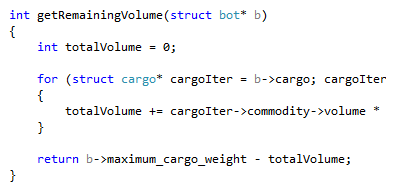

# Things the girls would've worked on if they had time
Clearly, there wasn't enough time for Seolhyun and Hyejeong to come up with a perfect algorithm to choose where to go. They have busy lives with much to do. One of the things they would've improved on if they had more time was the dumps. It's obvious that the dump decision is flawed, as the scores should actually be calculated pretending to have empty cargo, before looking at whether a seller is more profitable than a buyer. This lil buggy might leave the girls with a heavy bag and not much to do.

Another thing to work on is how cunning they are at predicting the others' moves. With more time, they would've taken into consideration more factors, such as number of turns to reach specific locations, and more importantly fuel to reach buyers/sellers.

However, overall, Seolhyun and Hyejeong are quite happy with what they are able to achieve. Being young, innocent girls with a humble upbringing, they really aren't too interested in making lots of money. They are just happy to have each other and live peaceful lives together. With a small bit of money, they have everything they need, food to nibble on, a book to read, coffee to drink, maybe even a TV to watch. In fact, they think it would've been nicer for the rich to have helped out the poor bots who were stuck in the middle of nowhere with no food no nothing. If it were possible, they would've shared fuel and things would those who needed it most. They don't like all this fighting that happens over buying and selling, in which case no one gets anything. With more sharing and caring, everyone could've been happier together.

Seolhyun and Hyejeong just being happy together :)

Love and peace, out

# Seolhyun and Hyejeong's final list of things to do when deciding where to go
Now that the decision making process has become more complex since the times when Seolhyun was working alone, they decide to refactor their ideas for the decision making process.

The final list of steps Seolhyun and Hyejeong come up with are:

1. Get profits for buyers and sellers
2. Punish them for how hungry Seolhyun and Hyejeong would get if they went there
3. Find the ideal place for them to go
4. Punish them to 0 if they would leave the poor babies stranded all by themselves
5. Consider places to eat if the place they wanna go the most is too far for how much they got in their tummy currently and also dumps if they're carrying too much useless stuff
6. Make the final decision on where to go
7. If there's no where to go, look again, but ignore their tummy :'(
8. Go to the final decision (if it's where they are right now, they will do whatever they should)

# Seolhyun and Hyejeong make sure they don't miss out on their delicious meals
Now that sellers and buyers scores have taken into account the rest of the world somewhat, Hyejeong also suggests that maybe they should consider the rest of the world when looking at places to eat too. As a result, Hyejeong whips up some algorithms which look at hungry peeps near eating places and subtracts the stocks accordingly. This is then used by Seolhyun in places such as calculating the penalty for locations that would leave them stranded, since now they can make sure that the place they plan to go eat after they go somewhere will still have food left over for them, and this will take into consideration others who steal their food :(.

Seolhyun and Hyejeong eating together

# Seolhyun and Hyejeong work together
With Hyejeong's help, Seolhyun will now be able to determine when to dump useless cargo. At first thought, Seolhyun thinks it's appropriate to simply go dump when all the buyers are zero. However, it is common in worlds with lots of peeps that a bunch of peeps are hanging out at a buyer stuck in a reduced to 0 loop of trying to sell their cargo, even though the buyer has a quantity, there may be more peeps than quantity. Of course Seolhyun doesn't want to end up in this situation. Next, Seolhyun has the idea that she'll reduce the buyers' quantity by the bots that are on that buyer with that quantity. The remainder will give Seolhyun an idea of what kind of share of the quantity she can actually access. So maybe she should go dump when all the buyers' quantity are essentially less than she own? 0? Seolhyun could see this probably wasn't the best way to approach this. So she decided to think about WHY you would ACTUALLY want to dump. The reason is clear, to clear up cargo space to make money on future transactions. Therefore, the worth of the dump should be based on how much cargo space is being used up and how much money could you make with this space if it were free for future transactions.

Therefore Seolhyun and Hyejeong come up with a plan together, if they used Hyejeong's algorithms to create algorithms which predict the 'actual' 'useable' quantity of sellers and buyers, these can be incorporated into Seolhyun's algorithms which currently just use the available quantity to make calculations. This would then mean buyer profits would drop accordingly. When buyer profits drop because of the new predicted quantity, then a different seller may be more profitable, since it’s a small quantity vs selling no quantity. Then a dump decision can be made if they would rather go to a seller rather than a buyer, then the dump would be give a score. The dumps score would be based on how much extra profit the space would allow them to make in the next transaction,and this is multiplied by the number of turns left, since the more number of turns left, the greater the benefit of having left over space. Of course, as usual, fuel costs are subtracted.

First, the algorithms to calculate seller quantity had to be made. This was done by looking at the number of bots around a seller with no cargo, and this was then multiplied by a percentage (2/3) to account for the fact that not every one of them would go to this seller. The quantity that these bots could hold is then subtracted from the seller's quantity. For the buyers, it's pretty much the same, except now Hyejeong only looks for bots that hold that specific commodity. Hence, it should be a more accurate prediction than buyer. With Hyejeong having these functions prepared, Seolhyun changes her profit calculators use the new predicted quantity rather than available quantity when making calculations.

Once this was done, the dump scores could be calculated for the dumps as above, and applied to the dumps so that it can be taken into account when making a decision.

Hyejeong and Seolhyun working hard together to sell sandwiches

# Seolhyun's issues, and a new friend to help!
Now Seolhyun is performing decently solo, in medium worlds at least. Usually getting 150-700% profit. But now she has to properly get ready to take on the multi bot world properly.

Seolhyun watching her profits grow

So far Seolhyun has had the peace and joy of frolicking about by herself with the whole world in her hands. She's only needed a set of functions to analyze the world and few other utilities to be able to make her decision. But when there're others lurking around, sometimes they can be big meanies and steal from Seolhyunchin 'o'). This means Seolhyun will need to somehow learn to dump when needed, and even better, to avoid situations where dumping/unnecessary moving/buying/selling even happens :o. For this she needs a buddy. But oooo! Just in time, guess who shows up, Who better than Shin Hyejeong :D. Hyejeong gives ideas as to how Seolhyun can better take on the multi bot world.

Hyejeong starts up her own file of functions specifically just for multi bot functions. She proposes the following functions:

- Get number of bots in the world
- Get number of bots at a location
- Get number of bots with no cargo at a location
- Get number of bots with a certain commodity at a location
- Get number of bots at a location with less than a certain amount of fuel
- Functions which do the above over a specified region rather than a single location
- Functions which predict how many bots are going to use a buyer/seller/fuel station

With Hyejeong coming into the story, the bot is appropriately renamed.

Hyejeong joining Seolhyun

# Seolhyun finalizes her meals for her lil tummy
Remember a while back when Seolhyun couldn't figure out properly when to fill up? Now that she has learnt more about the world around her, she can.

Since Seolhyun can decide where she wants to go, where she can and can't go, it's time to figure outwhat she can do to go where she's never been able to go before. To do this she needs to prepare well for the journey by getting her tummy full :). Places where she can refuel will get a score if where she wants to go is where she can't go. The score of the place she wants to go to but can't will get transferred over to this place. Of course she has to subtract once again for the energy it takes to get to this place in the first place. However, since going to refuel has benefits lasting longer than simply the score of the next thing she wants to do (most likely, unless her tummy is so tiny she can only hold enough for one transaction's worth of travel), the score is multiplied by a certain value.

Specifically:

Minimum( (turns left - turns required - 2) / 4, (tank capacity - fuel) / maximum move / 2)
This simply takes into account the number of turns left and how much more can fit in her tummy. She also a good girl with a good upbringing so she knows not to waste her food. As a result, she only buys as much as she needs to, hence she doesn't always eat till she's full towards the end of the game. This is done as a factor of 2/5 of the number of turns left.

# Seolhyun's final punishments
Now that the seller and buyer have a decent score system, they need a proper punishment system to go with them.

The seller and buyer penalty sets their score to 0 if they would leave poor baby Seolhyun stranded :(. Seolhyun will remember these scores for later use.

Both the buyer and seller penalizers are fairly similar. They check how far they are, if it's outside the fuel range, obviously it gets penalized and if the fuel station is too far after going to that location (would be stranded), penalized. The only differences would that sellers need more turns and fuel to be useful.

# Seolhyun's final algorithm for calculating the score of the buyer
The seller was quite hard work, but thankfully the buyer is simpler, since it only needs to be considered if Seolhyun has the right commodity for that buyer. For this, the amount that can be made with the current commodity in the cargo at that buyer's price is that buyer's gross profit. A multiplier is also added to this based on the number of turns left. This is because Seolhyun thought it makes sense to sell off commodity as quick as possible, since it frees up cargo space for later transactions, and this would be a function of how many turns are left.

# Seolhyun's final algorithm for calculating the seller
After a lot of sweaty, grueling trading, Seolhyun was able to come up with a fairly decent algorithm to calculate the score of the sellers.

For a seller, Seolhyun looks through all its buyers and picks out the most profitable one.

To pick out the most profitable one, she first checks the maximum quantity that she can currently trade between them. This takes into account cargo size, buyer/seller quantity, and Seolhyun's back pocket change.

Funny story, for quite a while, Seolhyun was doing:

Silly girl, she was subtracting weight from volume. Tsk, had to give her a virtual slap for that.

Anyways, after getting this quantity, multiplying it by the difference in buyer and seller price gave the gross profit that can be made by making a trade between them. After this, the average cost of fuel is used to apply a penalty to the score based on how far the buyer is from the seller.

Seolhyun's face after she realized she made a boo boo

# Seolhyun becomes a lil more transparent
Before starting on improving Seolhyun, Seolhyun needs to be more transparent what she's doing. Because of this, I improved the logging on Seolhyun so that I could properly observe each of her decisions and the reason for them, then I would have somewhere to go from to improve her.

The output Seolhyun gives looks like:

 

Seolhyun speaking up

# Seolhyun gets her pretty head working to stop being indecisive
Now that a basic buyer and seller scoring process has been implemented, Seolhyun can use this to make her first decisions. For now, the decision system will be quite simple, just move towards the highest score location in the world, and if she's already on the highest score location, she'll perform the appropriate action.

After quickly implementing this, the next step was to rate the fuel station. When thinking about how much a fuel station is worth, logically it should depend on how valuable the fuel is, and how valuable the fuel is depends on what can be done with the fuel. However, that's too complicated for Seolhyun at the moment, so for now, she'll go to refuel when she's quite hungry, only quarter full.

Once this was done, it was time for Seolhyun to go through some real tests. Seolhyun decided to join the big bad tournament world. After a few runs, it seemed Seolhyun was capable of earning around the average million profit mark.

# Seolhyun starts looking for da bling bling bing bing
Now that Seolhyun can sorta rate the sellers, it’s time to rate the buyers too. The 'profitability' of the buyers will of course be based on the goodies she's got on her small back. This is a simpler thought process for Seolhyun as she simply has to consider what she has, and how much some fool will pay for it. This amount will be the swag points that buyer deserves. Of course the further they are from Seolhyun, the bigger the penalty they get on their score (based on distance and scaling on average fuel cost). Since there are less factors that Seolhyun has to take into consideration as she scores the buyers, we can assume this score is more 'correct' than the seller scores. This isn't important for now, but may be in the future when Seolhyun needs to process the scores to make a decision. Of course these scores would still be far from perfect since the surrounding area is still relevant as to the move Seolhyun would take afterwards if she were to go here.

Seolhyun doing business

# Seolhyun learns to analyze the world… a bit
It took a while to consider, but Seolhyun eventually decided that she should develop a scoring system to make her decisions. Her preliminary idea is that the 'unit' per se for this scoring would simply be cold, hard cash. She decided to choose this over some ratio based number (such as percentage profit) since she realized that deciding a ratio would be too complex since there are too many variables involved, and straight cash would be simplest. Also, she decided this would be easier to implement than a branching based decision making algorithm as this is a lot more flexible and more factors can be taken into account by simply adding or subtracting from the score. Whereas some sort of decision tree would have to be perfectly planned from an early stage and wouldn't be able to be yolod as easily.

The first ability Seolhyun starts to learn is to rate sellers. Since she's not very smart (yet), she considers each seller only to the closest buyer. By taking the profit that can be made between each seller and its closest buyer in one transaction (while considering free cargo, cash, cost of fuel to travel between buyer and seller). While this has obvious flaws (e.g. a more profitable buyer could be just around the proverbial corner). Also this rating system doesn't take into account the seller's surrounding area. In other words, Seolhyun's tunnel vision could lead to her demise. The rating of any location should obviously consider what's nearby, such as fuel stations, and other profitable seller/buyers that will allow Seolhyun to continue making profit without moving a lot. For now, we'll ignore this, ignorance is bliss after all.

Seolhyun trying to figure out what to do

# The beginnings of Kim Seolhyun
Before miss bot is able to do anything useful, she had to be taught some basic skills which allow her to understand the world better. This included basic functions such as looking for the closest fuel station from a specific location, the distance between two locations, the average cost of fuel, the closest buyer for a seller, calculate remaining weight and volume of cargo and total number of locations in the world.

For the average fuel cost, it takes the quantity available at each fuel station into account, so the weighting that each fuel station has on the mean cost is based on the percentage of fuel it holds as compared to the total fuel in the world. It is obvious this isn't completely correct, since travelling to different areas of the world will result in different cost for fuel. Hence, when the fuel cost is used to penalize travel cost to location, it should actually be more based on the closer fuel station. However, for now, Seolhyun will assume this is an accurate enough indicator to measure the cost of travel when making her calculations.

After writing these functionalities, checks had to be done to verify Seolhyun wasn't being naughty and the numbers were all correct. A mistake that took a bit of time was that I forgot to pass a pointer to a pointer to let the function modify the original pointer (to return a pointer to a location). For now it seems Seolhyun's basic capabilities are working, but they probably will require extending in the future as she gets smarter and thirsts for more information.

Picture of nervous Seolhyun being a bot

# Reflection on COMP1511
Looking back at weeks 1-12 what was good about COMP1511 and what was bad. What would you like to see dropped from COMP1511 and what would you like to see added.

For me the COMP1511 coursework was mostly a good reminder of the basics of C. The only challenging parts were the assignments, which I personally thought would be too hard for beginners which caused many to drop out or not really care anymore. The assignments also caused people to stop listening during lectures to work on them instead, which meant they didn't learn C properly which was problematic later on. A good addition for the assignment would have been group work, so that people can share ideas more and learn off each other, rather than only having themselves to solve the problem, which can be very hard if you're just starting out.

In general tutes and labs were quite good. Maybe labs could've been more about teaching than doing lab exercises to get marks.

# Progress on assignment 2: what do I have working and what doesn't work, what have I figured out and what don't I understand yet.
So far I've got some crude scoring functions working. These include a seller and buyer profit calculation. The seller function simply takes into account its closest buyer and calculated the profit that can be made between these two locations while accounting for the fuel cost to travel between the seller and buyer. While the buyer calculation takes the bot's current cargo into account and if the buyer trades any commodity that's in the cargo, the money that can be made by selling to the buyer is used as a score.

The fuel station is more complex as it has to take many more factors into consideration. Currently, I've calculated the score for the fuel station based on profits that are out of range and can only made by buying more fuel. This will have to be tuned more to include more variables such which profits get added, and the number of turns that are left.

I still have a lot more thinking to do around how to use these scores to actually make the decision as to what action to perform and with what n (how much to buy/sell/move). Currently I'm just aiming for the location with the highest profit score, however it's obvious that this isn't optimal, so more thought will have to be put into this.

# Week 10 - Plans and dreams for assignment 2
I've spent many hours thinking about possible strategies for the trader bot. After a lot of consideration, I decided I will go for a score based system after all. This was one of the initial ideas, but I tried to also think of possible alternatives. However, after considering all the variables that have to be taken into account, some sort of score system would have to be developed as far as I can see.

For the moment I can only see how to get started on some of the scoring. This would be scores based on the gross profits that buyer and sellers can offer. Along with this, some basic penalties can be applied for things such as distance between bot and location, and between seller and buyer.

Other than this, there are many parts that are difficult to properly take account. For example, there is a inherent circular dependency on the scores. Specifically, if there are multiple profitable buyers/sellers in one small area, each one of them should have a higher value since once you've used one buyer/seller, another profitable one is near one. Therefore these places should have a higher score than a solitary profitable pair elsewhere in the map.

Another major issue is fuel stations. Since these places have no profit involved in them, their profit lies in the profit they enable you to make. This would be a fairly complex equation that would require further consideration.